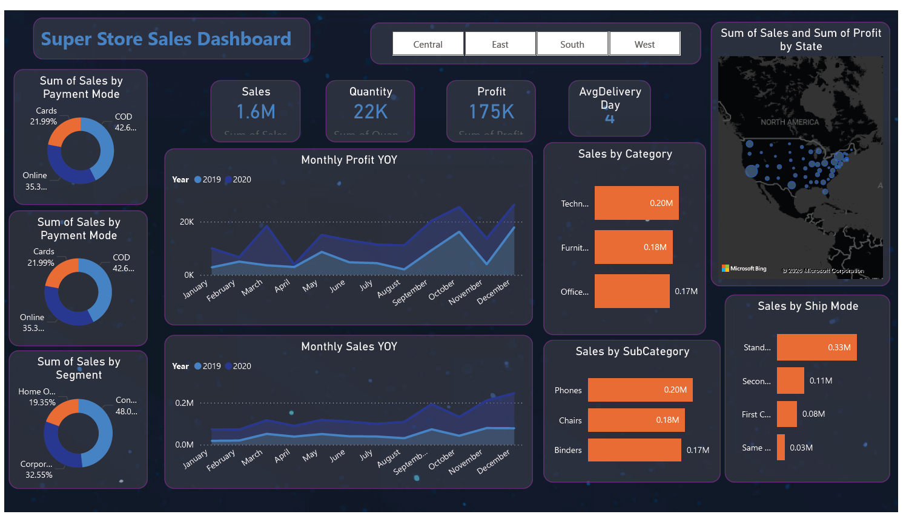

📊 Superstore Sales Analysis & Forecasting Dashboard

A data analytics project using Microsoft Power BI to analyze supermarket sales performance and generate short-term sales forecasts using historical data.
The project focuses on identifying key business KPIs, analyzing sales trends, and building an interactive dashboard to support data-driven decision making.

📌 Project Overview

This project analyzes Superstore sales data to understand business performance across different dimensions such as category, segment, state, ship mode, and payment method.

An interactive dashboard was developed to help stakeholders monitor KPIs, explore trends, and generate insights that support strategic planning and operational improvements.

Additionally, time series forecasting was applied to predict sales trends for the next 15 days based on historical data.

🎯 Project Objectives

- Apply data analysis techniques to extract meaningful insights from sales data

- Identify key business KPIs and visualize them through interactive dashboards

- Evaluate the effectiveness of sales strategies through visual analytics

 - Implement time series analysis to forecast future sales trends

- Provide actionable insights and recommendations for business growth

📂 Dataset

The dataset contains superstore sales transactions, including:

 - Order Date

 - Sales

- Profit

- Quantity

- Category & Sub-Category

- Customer Segment

- Ship Mode

- Payment Mode

- State / Region

This dataset is used to analyze sales performance, profitability, and operational efficiency.

🛠 Tools & Technologies

🐍 Python (Data exploration)

📊 Microsoft Power BI

📈 Data Visualization

⏳ Time Series Forecasting

📑 Excel Dataset

📊 Dashboard Features

The Power BI dashboard includes the following key metrics and visualizations:

Key Performance Indicators (KPIs)

- Total Sales

- Total Profit

- Total Quantity Sold

- Average Delivery Time

- Visualizations

- Sales by Category

- Sales by Sub-Category

- Sales by Segment

- Sales by Payment Mode

- Sales by Ship Mode

- Sales by State (Map visualization)

- Monthly Sales Trend (Year-over-Year)

- Monthly Profit Trend

The dashboard also includes interactive filters that allow users to explore the data at different levels.

📈 Sales Forecasting

Using Power BI time series forecasting, the project predicts future sales trends for the next 15 days based on historical order data.

This helps businesses:

- Anticipate demand

- Plan inventory

- optimize sales strategies

- Improve operational efficiency

💡 Key Insights

- Technology and Furniture categories generate significant sales revenue

- Certain sub-categories contribute disproportionately to profit

- Online and card payments account for a large share of transactions

- Sales patterns vary across regions and customer segments

- Forecasting helps identify potential future sales trends and demand fluctuations

📚 Learning Outcomes

- Applied data analysis techniques and visualization to business data

- Built an interactive Power BI dashboard for KPI tracking

- Performed time series analysis for short-term sales forecasting

- Generated actionable insights to support business decision-making

▶ How to Use the Project

- Download the .pbix file from this repository

- Open the file using Microsoft Power BI Desktop

- Explore the dashboard and interact with filters to analyze the data

📸 Dashboard Preview

Example:

